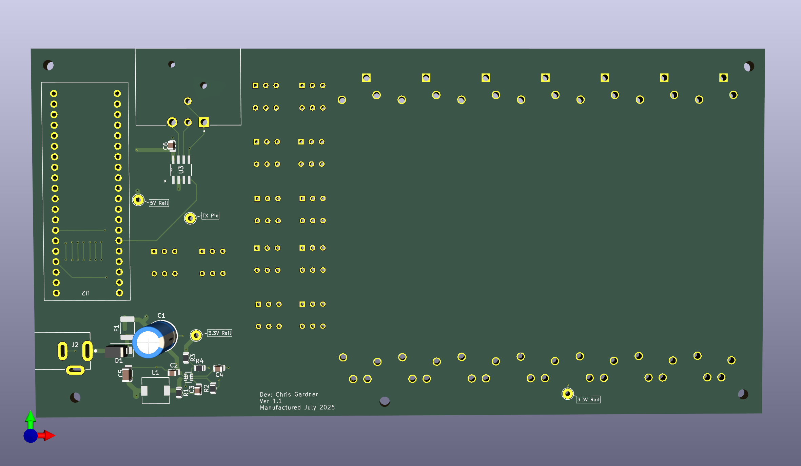
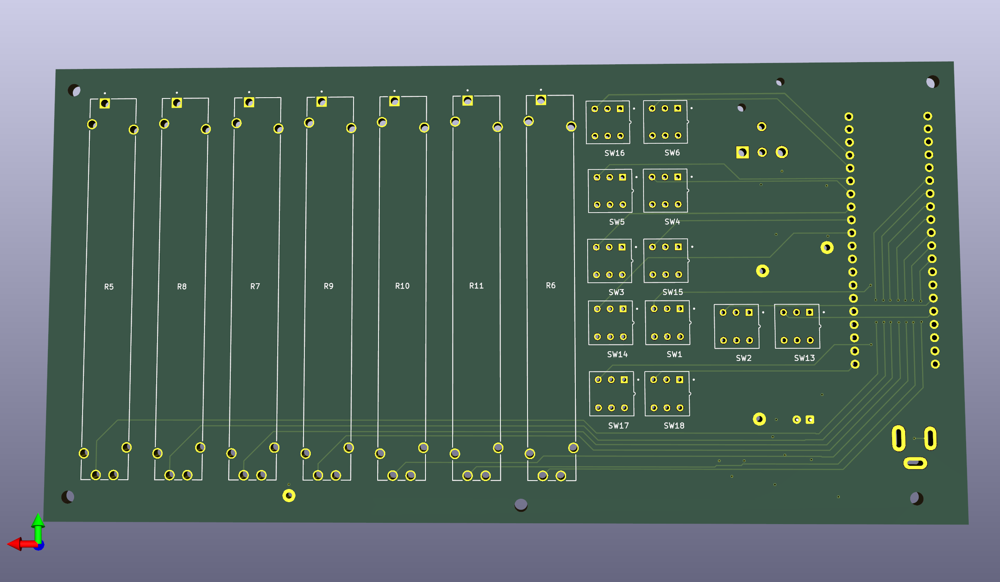
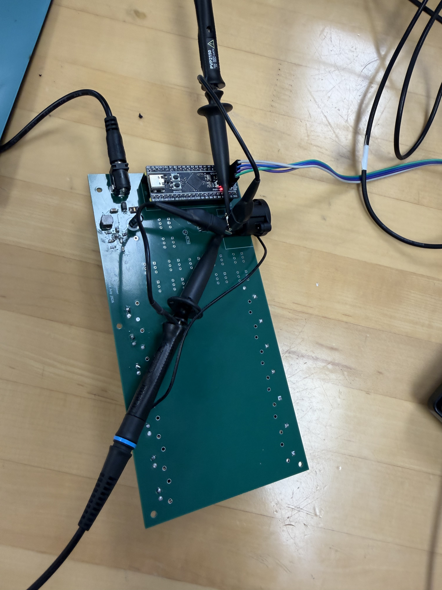
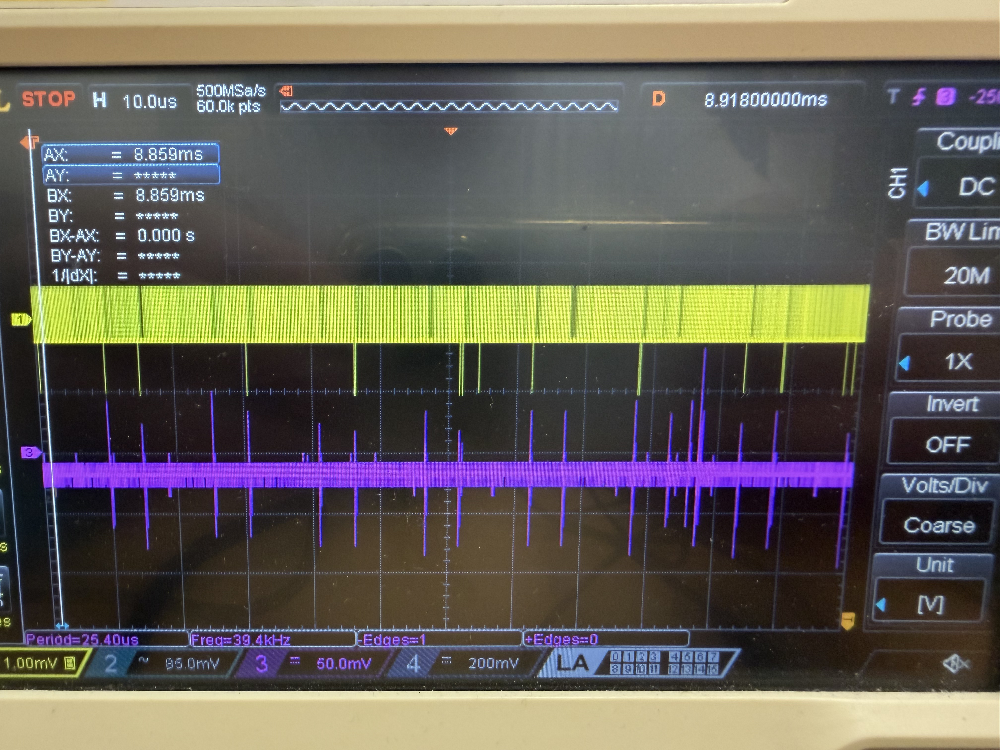
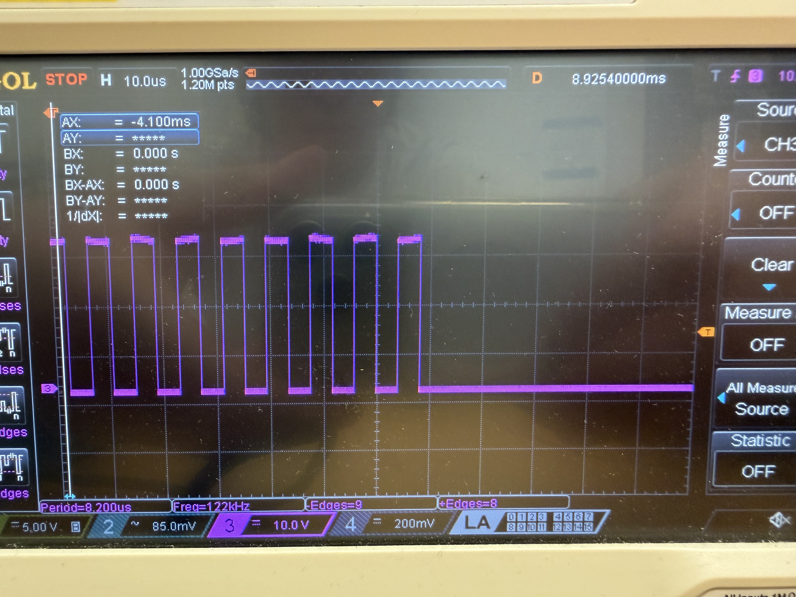
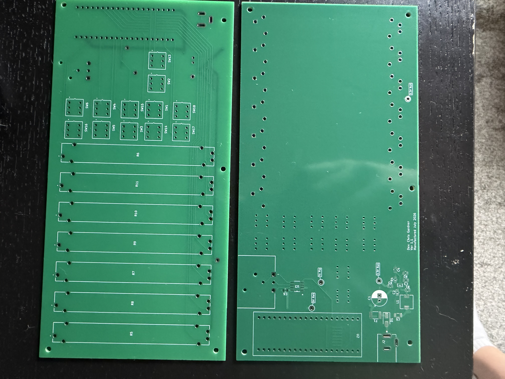

# DMX512_Controller
## Overview
Custom DMX512 lighting controller built around an STM32F411 BlackPill microcontroller. Completed schematic capture, four-layer PCB layout, DRC verification, and manufacturing file generation, integrating power distribution, analog input circuitry, an MP2393 buck converter, and an RS-485 transceiver for DMX512 communication.

The project combines embedded firmware development, custom PCB design, hardware validation, power electronics, and DMX512 protocol implementation, providing experience from system architecture through production-ready hardware.

## Specifications
<table>
  <thead>
    <tr>
      <th>Parameter</th>
      <th>Specification</th>
    </tr>
  </thead>
  <tbody>
    <tr>
      <td><strong>Microcontroller</strong></td>
      <td>STM32F411 Cortex-M4</td>
    </tr>
    <tr>
      <td><strong>RTOS</strong></td>
      <td>FreeRTOS</td>
    </tr>
    <tr>
      <td><strong>Protocol</strong></td>
      <td>DMX512 over RS-485</td>
    </tr>
    <tr>
      <td><strong>Inputs</strong></td>
      <td>7 Analog Faders</td>
    </tr>
    <tr>
      <td><strong>ADC</strong></td>
      <td>12-bit</td>
    </tr>
    <tr>
      <td><strong>Output</strong></td>
      <td>512 DMX Channels</td>
    </tr>
    <tr>
      <td><strong>PCB</strong></td>
      <td>4 Layers</td>
    </tr>
    <tr>
      <td><strong>Power</strong></td>
      <td>5 V to 3.3 V Buck Converter</td>
    </tr>
    <tr>
      <td><strong>Validation</strong></td>
      <td>Oscilloscope + Functional Testing</td>
    </tr>
  </tbody>
</table>

## Block Diagram

## Control Strategy
The DMX takes a 5V signal which drives both the RS-485 transceiver and the STM32 Microcontroller. The 5V is brought through a step-down chip that creates 3.3V to power the linear potentiometers that act as the faders which the microcontroller interprets as different signal values for lighting.

## PCB Design
 

## Measured Results
For ver 1.1 the step-down module to 3.3V failed however, after connecting a jumper from the MCU step-down pin, 3.3V was achieved. 

Fully functional UART (Right Image) and RS-485 Transmission (Left Image).

 

## Versions
### Ver 1.1 
- Add 12 pushbutton switches for programmed options
- Fix orientation errors of ver 1.0
- Changed to four-layer PCB
- Finished FreeRTOS tasks

### Ver 1.0
- Prototype PCBs submitted for fabrication.
- Developing FreeRTOS firmware for DMX512 communication, analog input processing, and system control.

